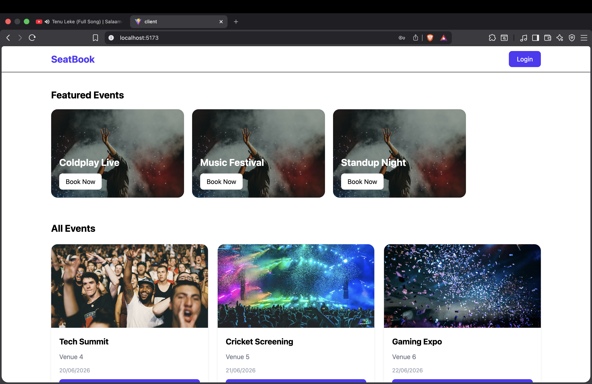
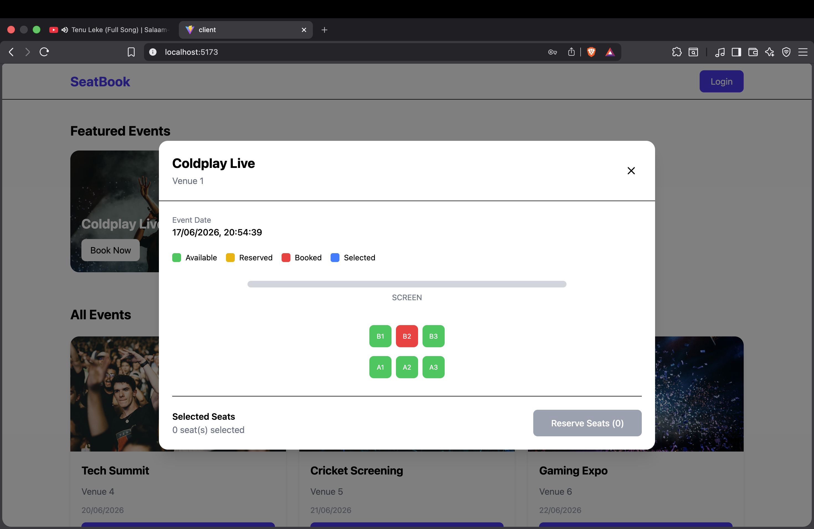
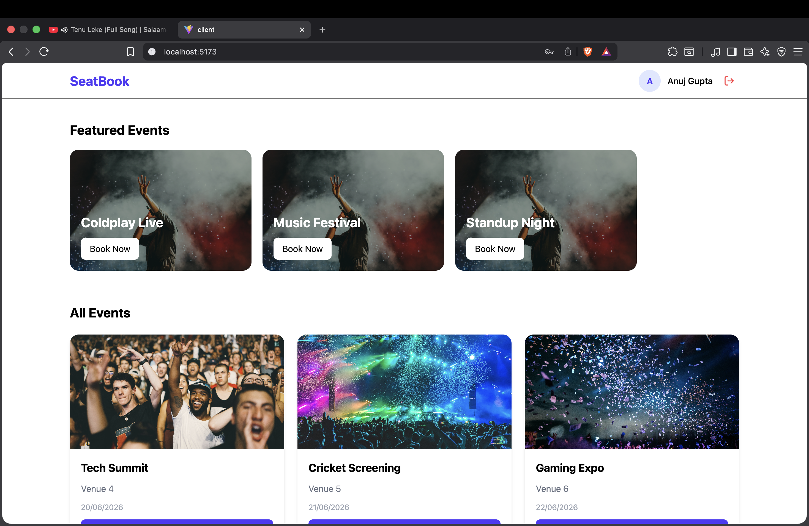
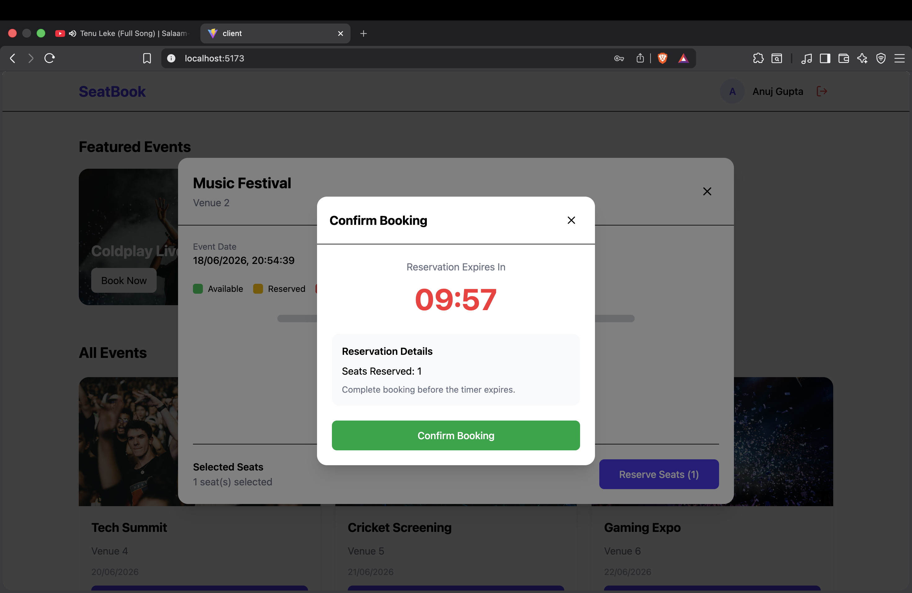

# SeatBook - Event Ticket Booking System

A full-stack event ticket booking application built using the MERN stack as part of the SortMyScene Full Stack Developer Hiring Assignment.

The application allows users to browse events, view seat availability, reserve seats temporarily, and confirm bookings while preventing double booking through controlled seat state management.

---

# Live Features

## Authentication

* User Registration
* User Login
* User Logout
* JWT Based Authentication
* Protected Reservation & Booking APIs
* Current User Session Support

---

## Event Management

* Featured Events Carousel
* Browse All Events
* Event Details Modal
* Event Seat Layout
* Seat Availability Status Visualization

---

## Reservation System

* Reserve Multiple Seats
* 10 Minute Reservation Window
* Reservation Countdown Timer
* Continue Existing Reservation
* Reservation Recovery Flow
* Reservation Expiry Handling

---

## Booking System

* Confirm Reserved Seats
* Prevent Expired Reservation Booking
* Convert Reservation into Booking
* Seat Status Updates

---

## User Experience

* Responsive UI
* Single Page Application
* Modal Based Navigation
* Loading States
* Error Handling
* Protected Actions

---

# Application Screenshots

## Home Page

Displays featured events and all available events.

```md

```

Features:

* Featured Events Carousel
* Event Cards
* Authentication Controls
* Responsive Layout

---

## Seat Selection

Displays event details and seat layout.

```md

```

Features:

* Available Seats (Green)
* Reserved Seats (Yellow)
* Booked Seats (Red)
* Selected Seats (Blue)
* Multi Seat Selection

---

## Authenticated User

```md

```

Features:

* User Avatar
* Logout Support
* Protected Reservation Workflow

---

## Reservation & Booking

```md

```

Features:

* Countdown Timer
* Active Reservation
* Booking Confirmation
* Reservation Expiry Awareness

---

# Technology Stack

## Frontend

* React.js
* Redux Toolkit
* Redux Async Thunks
* Axios
* Tailwind CSS
* Lucide React

## Backend

* Node.js
* Express.js
* MongoDB
* Mongoose
* JWT
* Express Validator
* Node Cron

---

# Project Structure

## Backend

```bash
backend/
│
├── config/
│   └── db.js
│
├── controllers/
│
├── cron/
│   └── reservationCleanup.cron.js
│
├── middleware/
│
├── models/
│   ├── user.model.js
│   ├── event.model.js
│   ├── seat.model.js
│   ├── reservation.model.js
│   └── booking.model.js
│
├── routes/
│
├── validators/
│
├── utils/
│
└── server.js
```

---

## Frontend

```bash
frontend/
│
├── components/
│
├── redux/
│   ├── store/
│   ├── slices/
│   └── thunks/
│
├── pages/
│
├── services/
│
└── App.jsx
```

---

# Database Design

## User

Stores authentication information.

```js
{
  name,
  email,
  password
}
```

---

## Event

Stores event information.

```js
{
  name,
  venue,
  dateTime,
  totalSeats,
  isFeatured
}
```

---

## Seat

Stores seat inventory for each event.

```js
{
  eventId,
  seatNumber,
  status,
  reservationId,
  reservationExpiresAt
}
```

Status:

```text
available
reserved
booked
```

---

## Reservation

Temporary seat lock.

```js
{
  userId,
  eventId,
  seatIds,
  expiresAt,
  status
}
```

Status:

```text
active
completed
expired
```

---

## Booking

Stores confirmed bookings.

```js
{
  userId,
  eventId,
  reservationId,
  seatIds
}
```

---

# Why Separate Seat Collection?

Instead of embedding seats inside the Event document, seats are stored separately.

Reasons:

* Easier seat status updates
* Independent seat querying
* Better scalability
* Cleaner database design
* Avoids large event documents

---

# Why Separate Reservation and Booking?

Reservation and Booking represent two different business states.

## Reservation

Temporary hold.

```text
User selects seat
↓
Seat becomes reserved
↓
Reservation timer starts
```

---

## Booking

Final confirmed purchase.

```text
User confirms booking
↓
Seat becomes booked
```

---

Benefits:

* Prevents permanent seat locking
* Allows reservation expiration
* Mimics real-world booking systems
* Cleaner business modeling

---

# Reservation Flow

```text
User Selects Seats
        ↓
Reserve Seats
        ↓
Reservation Created
        ↓
Seat Status = Reserved
        ↓
10 Minute Timer Starts
        ↓
Confirm Booking
        ↓
Booking Created
        ↓
Seat Status = Booked
```

---

# Reservation Expiry Flow

```text
Reservation Created
        ↓
User Leaves Application
        ↓
Reservation Expires
        ↓
Cron Job Executes
        ↓
Seat Status Reset
        ↓
Seat Becomes Available
```

---

# Cron Job

A scheduled cron job continuously checks for expired reservations.

Purpose:

* Release reserved seats
* Update reservation status
* Maintain seat inventory consistency

Location:

```bash
backend/cron/reservationCleanup.cron.js
```

Executed during server startup.

---

# Preventing Double Booking

Before reserving seats:

```text
Check seats are available
↓
Create reservation
↓
Mark seats reserved
```

Before booking:

```text
Check reservation exists
↓
Check reservation active
↓
Check reservation not expired
↓
Create booking
```

This prevents multiple users from booking the same seat simultaneously.

---

# Why Transactions Were Not Used?

Initially, MongoDB transactions were considered.

However, MongoDB transactions require:

```text
Replica Set
or
MongoDB Atlas Cluster
```

The project was developed using a local standalone MongoDB server.

Attempting to use transactions resulted in:

```text
Transaction numbers are only allowed on a replica set member or mongos
```

Therefore atomic seat state validation and controlled update operations were used instead.

If deployed using MongoDB Atlas or a Replica Set, transactions can be enabled with minimal changes.

---

# Frontend Architecture

The frontend follows a component-based architecture.

Major Components:

```text
Navbar
FeaturedCarousel
EventCard
EventDetailsModal
BookingModal
LoginModal
RegisterModal
SeatGrid
```

---

# State Management

Redux Toolkit is used for global state management.

---

## Auth Slice

Responsible for:

* Register User
* Login User
* Logout User
* Current User

---

## Event Slice

Responsible for:

* Fetch Events
* Fetch Event Details
* Featured Events
* Seat Layout

---

## Booking Slice

Responsible for:

* Seat Selection
* Active Reservation
* Booking Flow
* Reservation Timer

---

# Why Redux Toolkit?

Redux Toolkit was selected because:

* Predictable State Management
* Better Scalability
* Centralized State
* Easier Async Handling

---

# Why CreateAsyncThunk?

All asynchronous API requests are implemented using Redux Toolkit's createAsyncThunk.

Examples:

```text
loginUser
registerUser
fetchEvents
fetchEventDetails
reserveSeats
confirmBooking
getCurrentReservation
```

Benefits:

* Loading States
* Success States
* Error States
* Cleaner Async Logic

---

# API Endpoints

## Authentication

```http
POST /api/v1/user/register
```

```http
POST /api/v1/user/login
```

```http
POST /api/v1/user/logout
```

```http
GET /api/v1/user/details
```

---

## Events

```http
GET /api/v1/event
```

```http
GET /api/v1/event/:id
```

---

## Reservations

```http
POST /api/v1/reserve
```

```http
GET /api/v1/reservations/current/:eventId
```

---

## Bookings

```http
POST /api/v1/bookings
```

---

# Environment Variables

## Backend

```env
PORT=8082

MONGO_URI=

JWT_SECRET=
```

---

## Frontend

```env
VITE_API_URL=http://localhost:8082/api/v1
```

---

# Installation

## Clone Repository

```bash
git clone https://github.com/AnujGupta-2674/Sort_My_Scene_Assessment.git
```

---

## Backend Setup

```bash
cd backend

npm install

npm run dev
```

---

## Frontend Setup

```bash
cd frontend

npm install

npm run dev
```

---

# Assumptions

* Authentication is required before reserving or booking seats.
* Reservations expire after 10 minutes.
* One active reservation can exist for a user per event.
* Seats are released automatically after expiration.
* Payment Gateway integration is outside the scope of this assignment.

---

# Future Improvements

* MongoDB Transactions with Replica Set
* Payment Gateway Integration
* Socket.io Real-Time Seat Updates
* Email Notifications
* Admin Dashboard
* Event Image Upload Support
* Reservation Recovery After Refresh

---

# Assignment Requirements Coverage

| Requirement                  | Status |
| ---------------------------- | ------ |
| Event Listing                | ✅      |
| Event Details                | ✅      |
| Seat Grid                    | ✅      |
| Reserve Seats                | ✅      |
| Booking Confirmation         | ✅      |
| Double Booking Prevention    | ✅      |
| Expired Reservation Handling | ✅      |
| Authentication               | ✅      |
| Responsive UI                | ✅      |
| Error Handling               | ✅      |
| State Management             | ✅      |
| README Documentation         | ✅      |

---

# Author

**Anuj Gupta**

MERN Stack Developer

Submitted for the SortMyScene Full Stack Developer Hiring Assignment.

